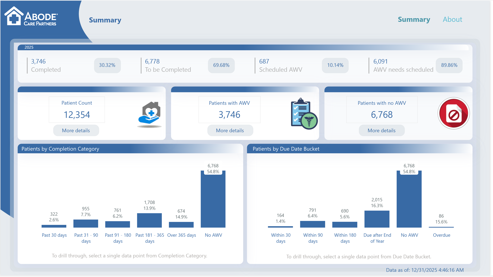
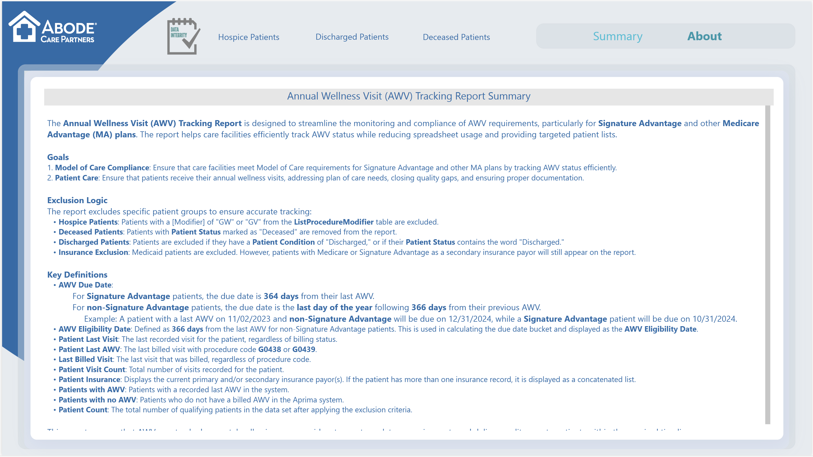
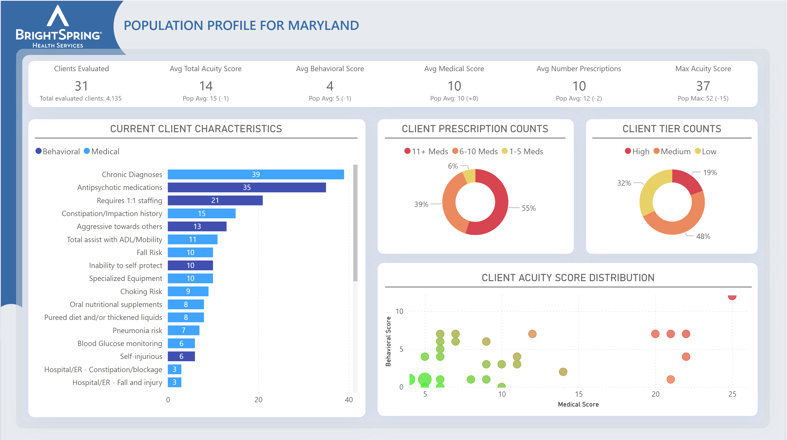
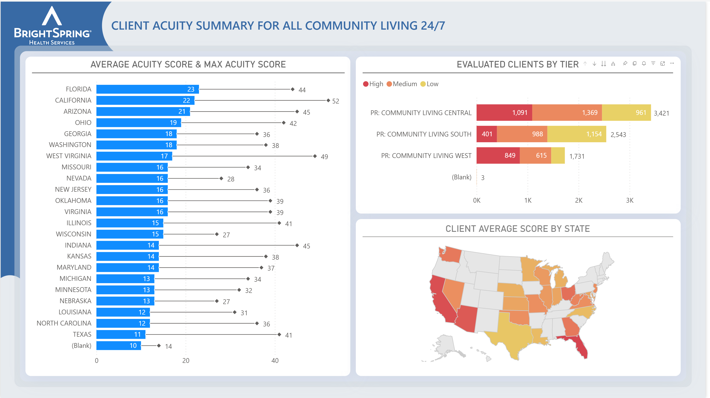
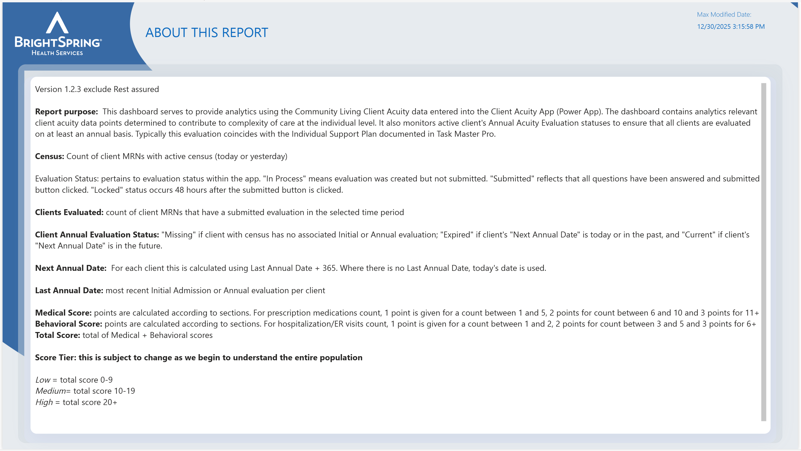
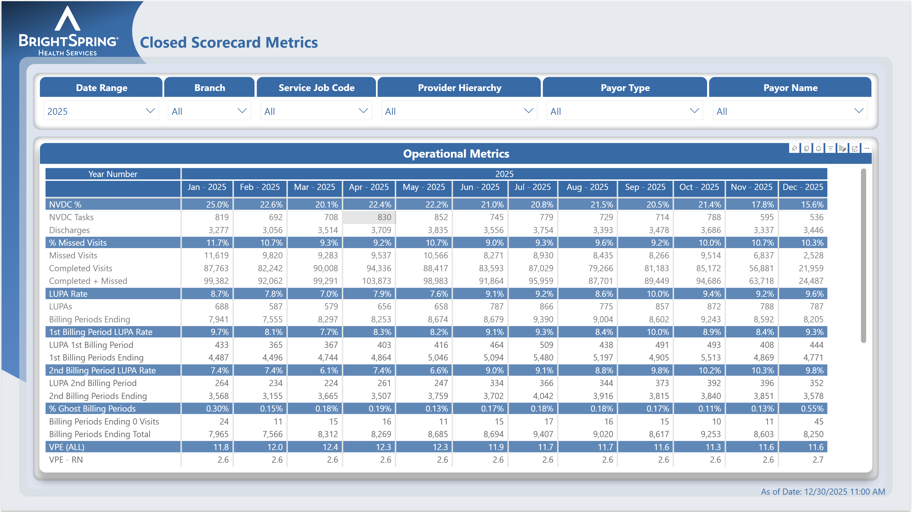
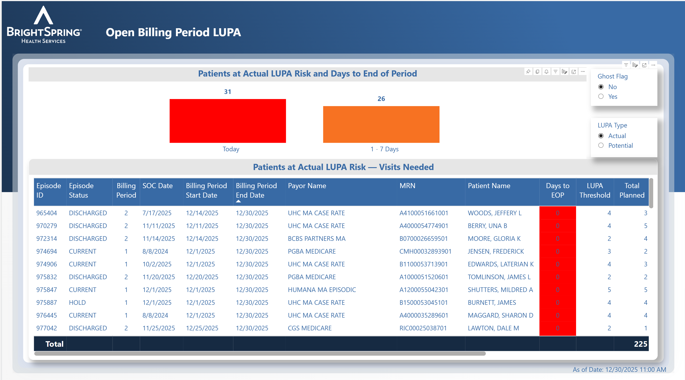
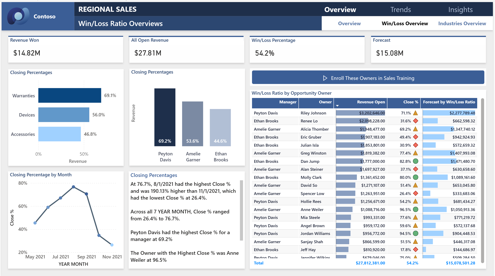

# Hi, I'm Melanie 

##  Business Intelligence Analyst | Data Analyst

I have over 15 years of experience across business intelligence, digital analytics, and data reporting, building end-to-end solutions that turn complex data into clear, actionable insights.

My experience spans multiple domains including healthcare, revenue cycle, digital and marketing analytics, and eCommerce. I’ve worked across a wide range of data sources and systems, with a strong focus on creating reporting that is accurate, reliable, and aligned with how the business actually operates.

---

##  Skills
- Power BI (data modeling, DAX, performance tuning)
- SQL (data transformation, validation, and query development)
- Data modeling and dataset design
- Data validation and reconciliation across systems
- Digital analytics (Adobe Analytics, marketing data)
- Healthcare and revenue cycle analytics

---

##  What I Focus On
- Building end-to-end BI solutions from raw data to final reporting
- Designing datasets that support scalable, reliable reporting
- Translating business needs into clear, actionable dashboards
- Ensuring data accuracy through validation and reconciliation
- Identifying gaps, inconsistencies, and opportunities within data

---

##  Experience Highlights
- Healthcare & Revenue Cycle Analytics (Humana, BrightSpring)
- Digital & Marketing Analytics (Adobe Analytics, campaign performance)
- eCommerce & Retail Analytics (TTI Floor Care, Kirkland’s)
- Education & Online Learning Analytics (The Learning House)
- Cross-system data validation and governance across multiple platforms

---

## 📁 Projects

###  Annual Wellness Visits Dashboard
Designed to monitor patient engagement and identify gaps in care, supporting outreach efforts and improving preventive care compliance.

---

###  Client Acuity Dashboard
Built to analyze patient populations by acuity level, helping prioritize care and better allocate resources across teams.

---

###  Operational Management Metrics
Focused on operational performance and billing-related indicators, helping identify missed opportunities and improve reimbursement outcomes.

---

### 📈 Regional Sales Dashboard
Created to track sales performance and win/loss trends across regions, supporting more informed and strategic decision-making.

---

## 🔗 Connect with Me
- LinkedIn: [Melanie Bodner](https://www.linkedin.com/in/melaniebodner/)
